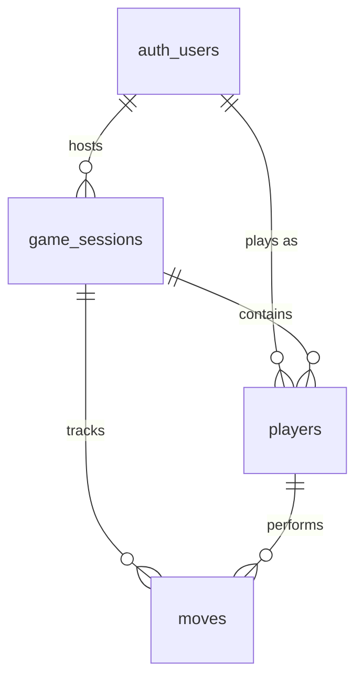

# Data Models

## User (`auth.users`)
Managed by Supabase Auth.
- `id` (UUID, PK)
- `email` (String)
- `created_at` (Timestamp)

## Public User Profile (`public.users`)
Mirrors auth users for public/shared access.
- `id` (UUID, PK, FK -> `auth.users.id`)
- `username` (Text)
- `avatar_url` (Text)
- `email` (Text): Duplicated from auth.users for visibility in lobby.

## Game Session (`public.game_sessions`)
Represents a single match.
- `id` (UUID, PK): `gen_random_uuid()`
- `code` (Text, Unique): Human-readable join code (e.g., "ABCD")
- `host_id` (UUID, FK -> `auth.users.id`): The creator of the game
- `status` (Enum): `waiting`, `active`, `finished`
- `phase` (Text): `lobby` (default), `selection`, `game` - Tracks granular game flow.
- `difficulty` (Enum): `easy`, `medium`, `hard`
- `current_turn_player_id` (UUID, Nullable): FK -> `players.id`
- `winner_id` (UUID, Nullable): FK -> `auth.users.id`
- `created_at` (Timestamptz)

## Player (`public.players`)
Links a user to a game session.
- `id` (UUID, PK): `gen_random_uuid()`
- `game_id` (UUID, FK -> `game_sessions.id`)
- `user_id` (UUID, FK -> `auth.users.id`)
- `character_id` (Integer, Nullable): *Deprecated* - Moved to `player_secrets`.
- `is_ready` (Boolean): Default `false`

## Player Secrets (`public.player_secrets`)
Secure storage for sensitive player data (character selection).
- `id` (UUID, PK)
- `player_id` (UUID, Unique, FK -> `players.id`)
- `character_id` (Integer): The selected secret character ID.
- `created_at` (Timestamptz)

## Move (`public.moves`)
Records actions taken during the game.
- `id` (UUID, PK)
- `game_id` (UUID, FK)
- `player_id` (UUID, FK)
- `action_type` (Enum): `question`, `guess`, `flip`
- `details` (JSONB): Stores dynamic data like "Question text" or "flipped card IDs"
- `created_at` (Timestamptz)

## Relationship Diagram (ERD)

## Security Policies (RLS)

### `public.users`
- **Select:** Public (Authenticated).
- **Update:** Self-service only (`auth.uid() = id`).
- **Insert:** Trigger-based or Service Role only.

### `public.game_sessions`
- **Select:** Public (Authenticated).
- **Insert:** Authenticated users only.
- **Update/Delete:** Host only (`auth.uid() = host_id`).
- **Uniqueness:** `code` column must be unique.

### `public.players`
- **Select:** Authenticated users (Restricted view planned for Epic 3).
- **Insert:** Users can only add themselves (`auth.uid() = user_id`).
- **Update:** Users can only update their own status (e.g., `is_ready`).

### `public.moves`
- **Select:** Participants of the game only (Planned).
- **Insert:** Active player only (Planned).
